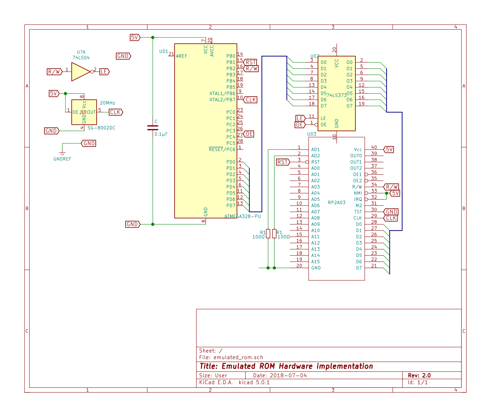

\newpage

# Appendix

This section contains material that may be of use to the reader. Appendix A presents circuit diagrams and flowchart figures. Appendix B presents the produced data in a raw form, compiled into tables.

## Appendix A

In this section, the flowcharts and circuit diagrams that were created during the research design and design phase are compiled, as well as revised versions from later in the project work.

{width=80% height=80%}

{width=50% height=50%}

{width=70% height=70%}

{width=50% height=50%}
