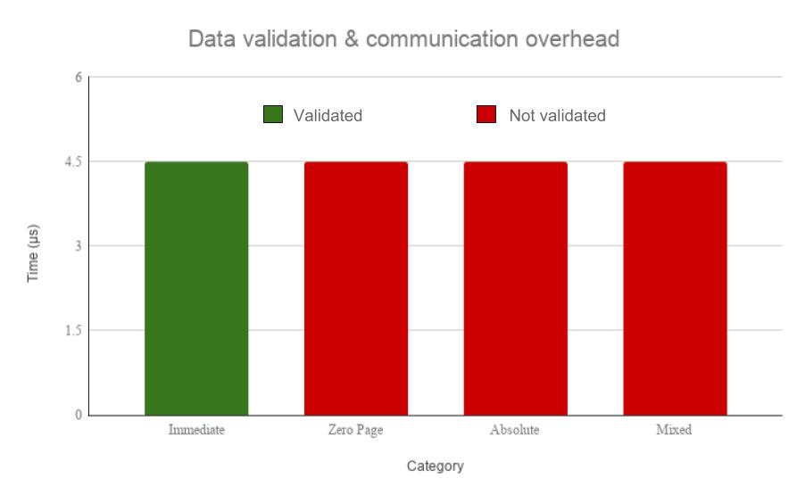

# Introduction

When integrating legacy information system components into a modern system, one of several usual approaches is to create an interface for the modern system to control or communicate with the legacy component. This approach is known as wrapping.[@Bisbal1999; @Sneed2000] Wrapping as a concept could be adapted for legacy hardware in embedded systems, to enable the original and proven functionality of the outdated system, by providing an interface to control the legacy components. There are few documented examples of migration of legacy systems that include the incorporation of the system including the hardware platform, and the few examples that exist are often designed with a specific functionality in mind. The NESizer2 project details a method wherein a modern microcontroller is used to wrap certain functionalities of the microprocessor used in a Nintendo Entertainment System, by dynamically injecting instructions to the microprocessor like an emulated ROM.[@NESizer2_GitHub] This thesis will evaluate how this method could be expanded upon to allow for a general use case of the legacy component, and to evaluate how well the method performs as a means of wrapping.

## Background

Computer based information systems are an invaluable asset for modern enterprises and corporations. The use of information systems can range from data storage, analysis and organization, to communication systems such as mail servers. With continued updating and upgrading of these systems they become increasingly complex, and as technology evolves the existing technology of the systems are quickly rendered obsolete, and "_eventually, the existing information systems become too fragile to modify and too important to discard_" [@ComellaDorda2000], and as such it can be considered a legacy system. [@seacord2003] At this point the legacy systems must be modernized, or migrated into a more modern system to remain viable.

When incorporating legacy information systems into modern systems, there are usually three popular approaches: redevelopment, wrapping and migration.[@Bisbal1999, p.2-4] While redeveloping an entire system is usually the best option in the long run, it is also the most expensive and risky. Therefore, migration is usually a more popular method, as it provides an interface to control the legacy components, while retaining its data and functionality. However, migrating systems to a modern platform can lead to unexpected behaviour, with a notable example being NASA’s Ariane 5 flight 501.[@Dowson1997;@Ariane-Board-Report]

When redevelopment and migration is too risky or expensive, wrapping offers a cost-effective option with less risk. It surrounds existing data, systems and interfaces with new interfaces, giving the legacy components a "new and improved" look [@Bisbal1999, p. 3], and lets organizations reuse trusted components in a new, more up-to-date manner.
While these methods usually focus on legacy software systems, they are very much applicable to hardware systems and components as well.

One way of wrapping a legacy hardware component is detailed in the hobby project NESizer2 by _Johan Fjeldtvedt_.[@NESizer2_GitHub] The project is a MIDI controlled synthesizer, using the original _Audio Processing Unit_ (APU) found embedded in the RP2A03 microprocessor, the microprocessor used in the Nintendo Entertainment System based on the MOS Technology 6502 architecture. In his method he uses a modern microcontroller to handle the normal functionality of a MIDI-controller aswell as controlling the RP2A03 by dynamically injecting instructions into the microprocessor when the APU is needed.

## Problem

To address the issues of unexpected behaviour in an otherwise proven, well functioning system, the solution could be to keep only the crucial legacy components including their hardware platforms, and provide an interface for a modern system to control them - creating a wrapper for both hardware and software. While there exists implementations of similar approaches, they are often designed with a specific functionality of the legacy component in mind, and as such does not provide a method of controlling the component for a general use case. This poses the question;

_Could these specific implementations be generalized into methods of controlling a legacy component, without any specific use case in mind? If so, how well do they perform as a means of modernization?_

To try and answer these questions, we will investigate the method used in the NESizer2 project, hereafter referred to as _The NESizer2 method_, to see if it can be expanded upon to be used as a _wrapper_ for the RP2A03 microprocessor. The method is considered a wrapper if it can allow a general use case of the microcontroller - specifically if it can successfully utilize the entire instruction set of the processor, thereby allowing any RP2A03 program to be run through the wrapper.

## Purpose

The purpose of this report is to investigate how the NESizer2 method performs as a means of modernization, by repurposing the method to handle the entire instruction set of the RP2A03 microprocessor, and measuring its performance in speed of execution as well as other key parameters.

The purpose of the work is to provide some insight to how well a relatively simple method of wrapping an outdated microprocessor can be expanded upon to function as method of modernizing a legacy embedded system. Although our work is very basic and does not cover the entirety of how to wrap a whole legacy system, we hope our findings can be used as a future reference for others interested in modernizing embedded hardware.

## Goal

The goal with the work is to provide insight into how an existing method of controlling legacy hardware can be extended to allow for general usage, and to give a performance evaluation of the method. This can hopefully give an indication of their usefulness as a method of modernizing an information system that uses legacy components.

### Social benefits, ethics and sustainability

If it is possible to wrap entire embedded legacy systems with relatively easy means, it could provide an alternative for businesses that are dependent on legacy embedded components to upgrade their systems without having to invest in, what most likely would be, expensive modernizations, and with minimized risk - as wrapping would keep the legacy components intact. We also hope that our work can contribute to other research that aims towards a more sustainable solution than discarding still functioning computer systems, which is becoming an increasing threat to our environment.[@SVTC_PoisonPCs_ToxicTVs]

We acknowledge that our research could contribute to the continued use of legacy hardware. While the process of discarding obsolete hardware etc. for new parts can have a negative impact on the environment, it is also important to note that upgrading hardware could prove to be a better solution, as much research and development into computer hardware is aimed towards lower power consumption and with a more up-to-date view on sustainable engineering.

## Methodology

In order to expand our knowledge and theoretical background in the field of research and define the research objectives, literature studies were conducted on several occasions during the research. A literature study is the systematic and methodical analysis of literature for a scientific purpose.[@LUI_litteraturstudie]

A literature study was also conducted to decide on a suitable scientific method under which to conduct the research. The scientific method acts as a framework or guidance for the researcher to conduct their research in a well defined and systematic way, based on the works and experiences of researchers before them, and it is crucial to a research in order to ensure quality and correctness of gathered results and analysis.

We found that experimental research was most suited to the nature of our research. The experimental approach allows for observing how a system's behavior changes as one variable is manipulated while other variables are kept stable [@IntroToResearch], and as such it is suitable for analyzing performance of a system.[@Hakansson_Portal] Details on experimental research is found under the section [Experimental research].

## Stakeholders

As previously mentioned, wrapping could provide an alternative for businesses to keep their legacy systems alive, meaning it could save a company a substantial economic and temporal investment. As such, our main stakeholders are businesses and corporations where the need to maintain old systems exists.

Another stakeholder, or rather a target audience, are electronic enthusiasts who design and create embedded systems of their own in hobby projects. Using ourselves as an example, the idea for this project sprung from our interest in constructing a music device that incorporated the Ricoh RP2A03 microprocessor, used in the Nintendo Entertainment System (more details on this in the [Trackers and the Chiptunes scene] section).

## Delimitations

The scope of this report is limited to the design and performance analysis of the NESizer2 method when it has been expanded to handle key parts of the 6502 instruction set, on a RP2A03 microprocessor. We chose to limit the instruction set by identifying groups of instructions that have similar characteristics, to ease implmentation and testing, and to be able to better draw conclusions on the overall performance of the system. Performance evaluation has been limited to speed of execution across the implemented instruction set, as well as the overhead as measured in time between consecutive instructions. The details of the implementation and evaluation criteria can be found in subsequent sections.

For a better indication of how well the communication method studied in our research can be adopted for other microchips/hardware and for a better picture of the behaviour of these communication methods on other systems, it would have been beneficial to implement them for two or more devices with different architectures. We have not tested intended use case performance of the RP2A03, i.e. having it read program instructions from a regular ROM, and as such we were unable to make a tested comparison of execution speed.

## Disposition

This report will firstly provide some background theory on legacy hardware and its use in a modern context, as well as an introduction to the hardware that has been used in this research. The research methodology used is presented in the following section together with other techniques and frameworks used to facilitate the research and development work. It is followed by a description of the project work, including the initial literature study and research phases, development phases and finally experiments and testing phases, followed by a section presenting the results from experiments. The last chapters will discuss the project work and the results from experiments, provide conclusions from the research work, and finally present ideas and thoughts about future work.

# Background theory/Technical background

This chapter provides an introduction of what legacy hardware means, and also discusses how legacy hardware is used in modern systems and particularly how old hardware is still used to create and produce retro-sounding music. It also introduces a hobby project that sparked the idea for this research. The second part of this chapter discusses some earlier work related to the research problem, and work that was used as a basis for the communication methods designed for this research.

## Legacy
Legacy is a term used in computing to mean "of, relating to, or being a previous or outdated computer system".[@Webster_legacy] This could, for example, be computer systems or components that might have had a widespread usage or been considered a standard in the past, but are no longer manufactured or maintained by the producer.

## Trackers and the Chiptunes scene

In the mid 1980’s, a type of music sequencer commonly referred to as a "tracker" appeared on the personal computing markets. Today, a community colloquially named the "chiptune scene" consisting of musicians and retro enthusiasts fascinated with the characteristic sounds of the old video game consoles, create and perform their own music with these trackers. While many artists use software that can emulate the sounds of these machines on modern systems, it is often considered high status to create the music directly on the old hardware. An often recurring example representative of the scene is the tracker software LSDj [@LSDj], written for the Nintendo Game Boy. Its portable nature makes it an ideal option for artists, being able to carry their "instrument" anywhere with ease.

We wanted to, as a hobby project, develop a prototype for a portable music tracker, similar to the Game Boy and LSDj, using the characteristic sound from the popular Nintendo Entertainment Systems (NES) processor Ricoh RP2A03. In our research, we realized that it would be beneficial if we could write the tracker software for a modern microcontroller that would in turn control the Ricoh chip as a slave unit. This would give us all the expansive capabilities of a modern microcontroller, while also providing us with the actual audio output of the NES.

We realized that our need to control the Ricoh chip in this fashion could also be applicable to other legacy systems that are in need of upgrades, and where emulation is not a viable option.

## MOS Technology 6502
The MOS Technology 6502 microprocessor and architecture was introduced on the market in 1975. It gained almost instant popularity due to its competative performance for a cheaper price than its competitors.[@IEEE-HoF-6502]

The 6502 microprocessor contains instruction families and addressing modes to control every part of the architecture. Other than instructions which target basic CPU functionality (such as controlling program counter, reading status register etc.), there are groups of instructions to perform operations with the accumulator and memory. Included in these groups are immediate, zero page and absolute addressing.

Immediate addressing utilizes a 2-byte instruction format, where the first byte is the opcode specifying the operation and the address mode. The second byte takes a constant, hexadecimal value known to the programmer. Immediate instructions are commonly used when comparing variables to known values, as it does not require the programmer to first store the value in memory and then load it upon comparison; they would only have to specify the immediate value in the source code. It requires a minimum execution time of 2 cycles (`OPCODE` + `VALUE`).

Another 2-byte instruction address mode is zero page addressing. Along with the opcode, it takes a second byte which contains the effective address in page zero of the memory. Effectively, this means that zero page instructions can be used for quick accesses to memory locations in the range of `0x0000`-`0x00FF`. Zero page instructions are often used when working with intermediate values in larger calculations, to shorten the total execution time.

Absolute addressing mode takes 3 bytes in its instruction format: `OPCODE` + `ADDRESS_LOW_BITS` + `ADDRESS_HIGH_BITS`. Since this gives the programmer access to the full 16-bit range of memory (`0x0000`-`0xFFFF`), it's considered the most normal addressing mode..

A full, detailed explanation of all of the available addressing modes can be found in the MC6500 Microcomputer Family Programming Manual.[@6502ProgManual] This research will utilize the three aforementioned addressing modes of the 6502 microprocessor. See [Delimitations] for further details on the choice of instruction families.

## Ricoh 2A03
The microprocessor that was used in the Nintendo Entertainment System was a Ricoh RP2A03 chip. The RP2A03 is a proprietary chip based on the MOS Technology 6502 microprocessor architecture, with the difference that it has an added Audio Processing Unit (APU), and it does not support _decimal mode_[^decimal-mode] that would normally be available on a 6502 architecture. [@IEEE-HoF-6502]

## ATmega328P

The ATMega328P is an 8-bit, low-power CMOS microcontroller based on the AVR RISC architecture, with a throughput of up to 1 MIPS per MHz.[@ATMega328_Datasheet] It is an easy-to-program, multi-purpose microcontroller that is included on the Arduino Uno and Nano microcontroller boards. It contains 32 KBytes ISP flash memory with true read-while-write operation, 1 KByte of EEPROM and 2 KByte of internal SRAM. It's 23 GPIO pins with programmable peripheral interfaces including SPI, I^2^C and USART makes it an excellent light-weight microcontroller for relatively small scale projects.

## Related work

Since the topic of this research is to test the NESizer2 method as a way of implementing hardware wrapping, the NESizer2 project should be considered closely related to this project. [@NESizer2_GitHub] We have used and modified key parts of the communication protocol and expanded it to allow for general usage (i.e. enabled it to handle any instruction that targets the Accumulator, ALU or Memory, and that is within the Immediate, Zero Page and Absolute addressing modes), but other parts of the NESizer2 project may be of interest for enthusiasts and hobbyists that are interested in this kind of hardware wrapping.

During the literature study, we also encountered an article describing work on injecting instructions directly to the program memory of an older generation CPU. [@inter-cpu-comm] Although our implementation does not inject instructions into a units program memory, the concept of injection is closely related. It is possible that the techniques described in that article could be used as an alternative method of hardware wrapping.

# Development and methodology

This chapter gives an introduction to experimental research and how it can be used in system performance comparison and analysis, followed by a theoretical background to agile development.

## Experimental research

During the research, a research method was applied to facilitate the process of analyzing and evaluating our implementation. A literature study was conducted in order to find an appropriate research method and strategy. The research methodology was chosen with the research question in mind; how to analyze and evaluate a system performance. The two main categories of research methodology are _quantitative_ and _qualitative_ research, which are separated by their founding philosophical assumptions. The qualitative research methodology assumes that observations, and importantly the conclusions drawn from them, are by their nature connected and dependent on prior knowledge and skill of the researcher and that the same observations might lead to different conclusions depending on the researcher. Qualitative research is mainly inductive in its nature, and the researcher will use their observations to infer _possible_ hypotheses based on observations. Quantitative research, on the other hand, stems from positivism; the philosophical stand point that all things are governed by principles or laws (e.g. natural) and as such it is possible for researchers to observe these laws to draw conclusions in their research.[@IntroToResearch, p. 23] Contrary to qualitative research, a quantitative approach is generally deductive, and is often aimed to confirm or deny a hypotheses that has been stated beforehand.[@Hakansson_Portal; @IntroToResearch]

One example of quantitative research is _experimental research_, which is a strategy where the researchers try to control all variables that can affect the outcome of an observation. By methodically manipulating the state of one variable at a time, while keeping other variables stable, it is possible to understand how different variables affect the phenomenon that is to be researched.[@Hakansson_Portal; @IntroToResearch, p. 26] As its main method of data collection, experimental research relies on experiments that are performed in this fashion. The gathered data can then be analyzed and used as a basis for conclusion to confirm or deny the stated hypotheses. In computer systems this method can be used to isolate the behaviour of the system for a certain input or event, and can be a useful method to analyze system performance.[@Hakansson_Portal]

We chose to work according to the experimental research strategy, seeing as it is a suitable approach to analyze computer systems. To analyze the performance of our implementation we have chosen to observe how _per-instruction-overhead_ and _completion time of a program_ varies with respect to different sets of instructions and the program length. Because of limitations in our implementation in its current state, further described in subsequent chapters, we hypothesize worse performance than if the chip could read instructions directly from a ROM, as intended. However, if the implementation is capable of executing the entire instruction set as expected, we believe that there are many areas of the implementation that can be optimized for better performance with relative ease.

### Experimental techniques in computer system performance research

The development of computer systems has long been an area heavily driven by the marketplace. In order to be competitive on the market, a computer system has to either provide the highest performance, or the most cost effective computing engines. This means that as developers of computer systems, we need to succesfully "understand and then eliminate the system bottlenecks that prevent us from exploiting the available technologies". To gain a good understanding of how modern computer systems behave, and to localize the source of bottlenecks in a precise manner, experimental techniques are required.[@P1990] In our research we have chosen one of these techniques when designing experiments to gather data and analyze the performance of our implementation - _hardware monitoring_.[@P1990] The reason for chosing only one of these techniques is that the scope of interest for this research is mainly to see how well the embedded hardware functions as a means of wrapping older hardware, and to deduce this we can gain sufficient data by monitoring the timing of hardware signals.

## Design and software development

This section provides a brief introduction to agile development and Scrum. These development frameworks were used during the project work to facilitate the design and development process of the research.

### Agile development

The term agile, meaning "to have a quick resourceful and adaptable character"[@Webster_agile], was made popular in the software development circuit by the Manifesto for Agile Software Development.[@AgileManifesto] The manifesto describes a model that, in contrast to traditional models for software development, embraces the fact that product description and requirements will most likely change during a development process, and adapts accordingly. It encourages building projects around motivated individuals, and promotes self-organization, continuous team meetings to reflect on the work that has been done, and regularly delivering work-in-process products to the product owner.

The agile software development model has spawned a number of frameworks to uphold the manifesto, including Extreme Programming (XP) and Scrum. These frameworks have helped set the standard of agile development, and has as such gained an immense foothold in the software development field. More recently, many universities are offering courses in the agile software development model, with research continously being done on how to effectively do so.[@AgileTeaching]

### Scrum

As previously mentioned, Scrum is one of many frameworks that implements the Manifesto for Agile Software Development. The creators Jeff Sutherland and Ken Schwaber define Scrum as the following [@ScrumGuide, p. 3]:

> _"Scrum (n): A framework within which people can address
> complex adaptive problems, while productively and creatively
> delivering products of the highest possible value."_

Scrum utilizes an iterative, incremental approach to manage risks, and to dynamically develop a solution to a problem. The project is broken down into a set of time boxes known as "Sprints". The creators of Scrum recommend a sprint length of no longer than a month [@ScrumGuide, p. 8], however the author of the popular Scrum introduction book "Scrum and XP from the Trenches" Henrik Kniberg recommends new Scrum teams to experiment with sprint lengths until they find a time frame that the team feels comfortable with.[@ScrumKniberg, p. 22]

Each member of the Scrum team is assigned a role. These roles include product owner, developers and Scrum master. Each role have a specific set of tasks to fulfill.

**Scrum Master:** Responsible for ensuring that Scrum is understood and enacted [@ScrumGuide, p. 6] by making sure that the each member of the team follows the Scrum theory, practice, and rules.

**Product Owner:** Responsible for maximizing the value of the product and the work of the development team[@ScrumGuide, p. 5], and of managing the so called "Product Backlog", which contains items/tasks/requirements(?) that are to be completed in order for the product to meet the definition of done.

**Developer:** Professionals who do the development work by delivering potentially releasable software at the end of each sprint.[@ScrumGuide, p. 6]

The framework employs four formal events that help make sure that the team can deliver at the end of each sprint. These events are known as Sprint Planning, Daily Scrum, Sprint Review and Sprint Retrospective.[@ScrumGuide, p. 7]

**Sprint Planning:** The Scrum team collaboratively decides on what can be delivered at the end of the sprint by moving tasks from the Product Backlog to a Sprint.[@ScrumKniberg, p. 24] A Sprint Goal is then created, which is a goal set by the team that can be reached by implementing the items in the Sprint backlog.

**Daily Scrum:** A short meeting, usually around 15 minutes, where the team discusses the work that they will do on that day. This is done in order to synchronize team members, improve communication and improve the teams knowledge.

**Sprint Review**: Held at the end of each sprint, where the Scrum team and possible stakeholders collaborate and discuss what was done in the sprint. The attendees inspect the Product Backlog and any changes that was made, decide on what could be done in the next sprint in order to optimize value. The meeting is held with the intention of generating feedback.

**Sprint Retrospective:** Held after the Sprint Review and before the next Sprint Planning meeting. It is held in order to inspect how the last Sprint went with regards to the team members, their relationships, the process and tools. The team tries to identify what went well, and what can be improved, with the aim to create a plan that improves performance in the next sprint.

## Evaluation criteria

In order to gain an idea of how well the NESizer2 functions as a method of hardware wrapping, and to have some additional guidance in identifying the relevant variables that needed to be tested in experiments, we established a few points that we wanted to test and evaluate;

**Performance in speed:** We need to know if the wrapping method was significantly slower than the component(s) being wrapped. Since the wrapping would allow the component to be used only at crucial times, and allow a larger portion of programs to be run on a more modern machine, we were mainly focusing on short and simple programs that would for instance utilize memory mapped functionality of the legacy hardware.

**Consistency in usage:** It is important that the method does not introduce any quirks that would have to be considered when implementing it as a wrapper. If certain programs or sequences of instructions behave differently when run via the wrapper compared to when run natively, the method would introduce too much friction to be viable as a wrapper. We decided to test this by grouping instructions by addressing mode into categories of instructions with similar properties, and to test groups of instructions both isolated and mixed together.

**Correctness:** Naturally, the wrapping method should not introduce or be responsible for any erroneous results during usage. We decided to use a digital logic analyzer in order to monitor the behavior of the system during the test programs.

**Bottlenecks and overhead:** For systems where timing is crucial, it is important to determine and understand any overhead or bottlenecks that come with the wrapper in order to determine its utility. Since the NESizer2 method was constructed to send one instruction at a time, we wanted to see how this affected a longer sequence of continuous instructions, and determine if there exists any significant delay between instructions.

# Project Work and Development

This section details the project work, including literature studies and the hardware and software implementation/design process as governed by the Scrum framework, and the design and implementation of experiments according to the experimental research approach. It has been structured to closely follow the steps of the project work in chronological order.

## Literature study

The project work started with a literature study, to gain knowledge on related work and theoretical background knowledge in the field of modernizing legacy hardware and legacy hardware used in modern applications. The search was performed using mainly the following databases of scientific publications: (i) IEEE Xplore, (ii) ACM Digital Library and (iii) Google Scholar. Additional searching tools used was simple internet searching tools such as _Google_, which could often provide ideas for additional keywords used when further searching in the databases. The results from this literature study was searched for using keywords the modernization/modernizing, legacy, hardware, microprocessor, computer. Based on the results of this search we further defined our keywords to target specific methods that seemed relevant, in order to find references on related previous work. The keywords used in this search was _legacy_, _microcontroller_, _microprocessor_, _master_, _slave_, _injection_, _wrapping_, _shared memory_. The results from both searches was selected with title, abstract and publication year taken into consideration. Most of the related work was found to be older than 10 years, but considering that the articles mentioned methods of controlling legacy hardware, and that the problem of upgrading/modernizing hardware is generally a problem for machines older than 10-20 years, we found them relevant to the research. Figure \ref{literature-study} shows a simple illustration of the iterative process of the literature study.

Another literature study was conducted in order to gain further knowledge on experimental research, how it is used in performance comparison and evaluation, and general information on scientific methodology and how it is used in research. The keywords used in this search were _experimental_, _research_, _methodology_, _computer_, _system_, _performance_. The search was conducted over the same databases mentioned above, and evaluated and selected using the same process. Anne Håkansson's article _Portal of Research Methods and Methodologies for Research Projects and Degree Projects_[@Hakansson_Portal] mentions the book _Introduction to Research in Education_[@IntroToResearch] as a source, and it has proved to be of great help when trying to understand what experimental research means, and how it can be used as a research strategy/methodology.

## Designing experiments

The experiments had to be designed not only to reflect our evaluation criteria, but in accordance with the experimental research approach they had to be designed around understanding how _the single independent variable_ and _the single significant variable_ affect the system performance.

When designing the experiments to evaluate performance in time, we used the categories of programs discussed in section [Evaluation criteria] and identified a set of all controllable variables that could have a significant impact on the results from each category. The variable chosen were:

i. Length of program, as measured in number of instructions
ii. Selection of timing for reset function
iii. Using emulated ROM functions or "pure" assembly

For each category we then designed an experiment that would test the performance when changing each of these variables while keeping the others stable.

To address the evaluation criteria _behaviour_, we included a data validation test to each experiment. The data validation is simply to verify that all test programs produced the expected output at each RP2A03 write cycle.

The outline of the experiments are further detailed in section [Experiments phase].

## Hardware and Software implementation process

When planning the project work we decided to use agile development and the framework _Scrum_ to govern the design and implementation process. We chose divide design and implementation work into categories _hardware_ and _software_, with one person responsible for each category. Before our first sprint we set up milestones and goals, and created a backlog of stories, or tasks, that would work towards reaching set goals. This backlog is what we used to define tasks to include in each sprints.

The sprint goals were then set to reflect stages of iteratively increasing implemented functionality in the method, and stories and tasks for that specific sprint were then chosen to reflect the sprint goal. For each sprint we also defined a set of one or more deliverables that should represent the result of that sprint. A detailed description of the work concluded in each sprint during the implementation process will be given below, and a summary of the sprint goals and deliverables can be seen in Table \ref{sprint-overview}.

Table: Overview of sprints and deliverables \label{sprint-overview}

Sprint #	Goal								Deliverables
----------	------------						--------------------
1			Research and Design phase done		Research and design documents
												for hardware and software
2-3			Basic communication working			Components, circuitry, and basic
												software needed for communication
4			Sending instructions				Hardware for debugging, Software
												for sending instructions
5			Entire instruction set working		Software supporting entire instruction set

### Sprint 1, Research and design phase

The research and design phase included research the NESizer2 software and hardware implementation. This research was made in order to pinpoint the parts from NESizer2 that we would need, and what modifications had to be done to it. We found that we could use the assembly routines (which was at the heart of the communication with the RP2A03) together with a simple 8-bit databus through an 8-bit latch to control flow of instructions, as a foundation for our implementation. This is detailed in the circuit diagram found in [Appendix A].

We also made research on the RP2A03 microprocessor, but since the RP2A03 is a proprietary chip, owned by Nintendo, there was not much official information available. However, a community of NES enthusiasts has, through reverse engineering, gathered much information on the processor on their forums and wiki-site _Nesdev Wiki_.[@NesdevWiki] Through these channels we were able to learn that the chip differs little from the MOS Technology 6502 architecture, and as such we could learn much about the chip through official 6502 hardware and software development guides.

Hardware design work then included research and decision of what hardware components were needed for our implementation, and finally to create a circuit diagram that we could use when building. Software design work resulted in a program flowchart and diagram of software components.

### Sprint 2 & 3, Basic communication

The first part of the sprint was aimed at basic testing of components. Testing the RP2A03 was hard without any specialized tools, but we found a online document detailing a simple method of testing (i) power on and (ii) data bus of 6502.[@6502Test] The method mentions how to test this by using an array of LEDs on the address pins, but we decided to expand the test to observe the chip with an oscilloscope; we monitored the Read/Write and Clock output pin of the chip to confirm that different inputs produced expected sequence of RW signals. This gave us the confidence that the data bus and instruction parsing functioned, at least on some level.

After component testing was concluded, the next step was building a simple circuit of components that, together with basic software and a simple test program, could confirm that basic communication between the microcontroller and RP2A03 was working as intended. The results were inconsistent and erroneous, and the build had to be debugged, which resulted in the sprint "overflowing" to the next sprint.

We finally realized that the problem was due to a misunderstanding in how the latch was used in NESizer2, and a simple edit to the circuitry resulted in consistent expected results. This confirmed that communication between the chips worked at a basic level. Figure \ref{misplaced_latch} and \ref{corrected_latch} in [Appendix A] illustrates the misbehaving circuit and the corrected circuit, respectively.

### Sprint 4, Sending instructions

Hardware work included implementing simple debugging and diagnostics that could be used to determine if something was not working as intended in a quick manner, and proved to be very helpful during the sprint. After concluding the hardware work of the sprint, the software work was distributed to both parties and implemented together.

The NESizer2 uses high(er) level functions for instructing the RP2A03 to play a note, or to modify the sound, etc., with the help of hardcoded assembly instructions that performed set memory operations. We wanted to extend these assembly routines to allow for any instruction to be sent, and to build our own higher level C functions that could be used in a C program for the microcontroller used in the implementation. This was achieved by categorizing the 6502 instruction set (which is the instruction set used by the RP2A03) into instruction families that use the same number of operands. At this stage we chose to focus on three main families; (i) Immediate operations, (ii) Absolute addressing memory operations, and (iii) Zero Page addressing memory operations. A summary of the characteristics of these families can be found in Table \ref{instruction_chars}.

Table: Instruction families and their characteristics \label{instruction_chars}

Instruction family		Size of instruction [B]			# Cycles / instruction		R/W Cycle sequence
----------------------  --------------------------- 	--------------------------	----------------------
Immediate				2								2							R, R
Absolute				3								4							R, R, R, R/W
Zero page				2								3							R, R, R/W

These characteristics was then used to redesign the assembly routines and to build the functions mentioned above. When implemented it was possible to send any opcode[^opcode] together with any operand, handled properly by the assembly routines.

### Sprint 5, Entire instruction set

The first part of this sprint focused on further extending the functionality of the previously written instruction handling, allowing a 6502 program to be stored and parsed as an array of byte instructions, functioning as a simple emulated ROM. This simplified the setup routine that had to be performed on boot of the RP2A03, as it could simply be written into the ROM, followed by the rest of the RP2A03 instructions we wanted to run.

When analyzing the 6502 instruction set further, we concluded that we were not interested in implementing support for branching instructions that conditionally jumps the program counter. This is because the RP2A03 reads instructions directly from the microcontroller, and as such branching has no real effect.

The second part of the sprint was aimed at thoroughly testing the entire instruction set, making sure that all instructions produced expected results. While all operations that used the accumulator register (immediate loads, ALU [^ALU] operations, etc.) worked consistently and as expected, we noticed that seemingly _none of the memory operations worked_. This is further detailed and discussed in sections [Results] and [Conclusions & discussion].

The sprint, and some continuous work during the experiments phase, was concluded without managing to resolve this issue.

## Experiments phase

In order to measure time according to our criterias, we attempted to set up the SPI peripheral on the Atmega328P. Unfortunately, the programmer we used did not support two-say SPI communication, which forced us to further extend the implementation with a second microcontroller unit.

The implementation was extended in hardware and software to include simple communication with an Arduino M0 Pro board, which was used to measure time. The choice of the Arduino M0 Pro as a hardware timer was the increased resolution of time, and the fact that it ran on a clock with more than double the frequency of the wrapper system, further increasing accuracy of the measurements.

To measure communication timing and cycles between instructions, we used a digital logic analyzer to monitor digital output. The data from the analyzer could then be collected both numerically (in the form of CSV) and as diagrams. On the RP2A03 we chose to monitor all bits of the data bus, as well as the R/W and output clock pins.

The experiments phase was conducted according to design, with the exception that any test cases involving memory operations could not be confirmed to produce expected results. The experiments were performed according to the following steps, and further illustrated in figure \ref{block_test}:

1. Validate data output and record per-instruction-overhead when all variables are at default values
2. Measure time of completion as program increases in length
3. Measure time of completion as time interval of reset increases
4. Measure time of completion when program is called with emulated ROM functions
5. Measure time of completion when program is called without emulated ROM functions
6. Switch to next category and repeat process until all categories have been tested

{ width=80% height=80% }

For step 1 we used a digital logic analyzer to measure the bit value on the output of the RP2A03, in order to ensure that an expected value was output. We also recorded the time and number of cycles between instruction for each instruction type at the same time.

For steps 2 through 5 we utilized the Arduino M0 Pro to act as a master controller unit, which we programmed to tell the Atmega328P to start executing programs on the RP2A03 on our command, and at the same time measure the time it took for the Atmega328P to execute. Three different test programs were written for each controller device (Arduino M0 Pro and Atmega328P), each following the same pattern:

The Arduino waits for the Atmega328P to signal that it has completed its setup routine. The Atmega328P then waits for a start signal from the Arduino, which is sent upon the press of a hardware button. When the button is pressed, the Arduino sends a _go_ signal to the Atmega328P and starts a timer. It then waits for the Atmega328P to signal that it has finished it execution, where upon the Arduino will stop it's timer and save the results. When the test program has finished, the Arduino outputs all the measured times.

# Results

This chapter details the results of all tests that were performed on the system. The tests were performed as outlined in the subchapter [Experiments phase], and the test results have been labeled

1. Data validation and per-instruction-overhead
2. Increasing number of instructions
3. Increasing frequency of resets
4. Using ROM-Emulation functions
5. Not using ROM-Emulation functions

, respectively.

Firstly, all tests are presented and compared across categories, followed by a comparison of tests for each separate category. The _Mixed_ category was not applicable in test case 5, since the task of reading mixed instructions and placing them correctly in the data structures used for communication would effectively result in the exact steps taken by the ROM-emulation functions.

## Comparison: Test cases

Test cases 1 through 5 are shown in figures \ref{data-validation}, \ref{increasing-instructions}, \ref{increasing-interrupt-timeout} and \ref{emurom-func} respectively. Categories are compared to each other in each figure where applicable. Table \ref{cycles-per-instruction} details the number of cycles needed per instruction in each category, together with a comparison against the number of cycles needed in an unwrapped system. See [Appendix B] for tables of raw test result data.

Table: Performance measured in Cycles per Instruction \label{cycles-per-instruction}

Category    Wrapped     Unwrapped   Difference
--------    -------     ---------   ----------
Immediate   8           2           400%
Zero Page   8           2           400%
Absolute    9           3           300%

As shown in figure \ref{data-validation}, data could not be validated for categories _Zero Page_ and _Absolute_, and subsequently not _Mixed_. The instructions sent from the master unit and the execution time on the slave unit behaves as expected, but the data output after execution is not correct. As shown in table \ref{mem-error}, the `LDA (0xA5)` instruction loads the value `0x04` from Zero Page address `0x24`, however trying to store the accumulator at another memory address strangely enough outputs `0x24` from the accumulator instead.

Table: Illustrating error in memory operations \label{mem-error}

Data bus	Comment
--------	-------
`0xA5`		Zero Page `LDA` instruction Opcode
`0x24`		Zero Page `LDA` Operand, Zero Page Address `0x24`
`0x04`		Returned value `0x04` from memory
`0x85`		"Idle" Zero Page `STA` instruction
`0x85`		"Idle" Zero Page `STA` instruction
`0x85`		"Idle" Zero Page `STA` instruction
`0x85`		"Idle" Zero Page `STA` instruction
`0x85`		"Idle" Zero Page `STA` instruction
`0x85`		"Idle" Zero Page `STA` instruction
`0x85`		Zero Page `STA` instruction Opcode
`0x06`		Zero Page `STA` Operand, Zero Page Address `0x06`
`0x24`		Value on accumulator to be written to memory (Expected `0x04`)

When not performing memory operations, i.e. accumulator writes and ALU operations, all data was validated as expected, even when performing sequences of connected operations. Table \ref{xor-accumulator} shows a short sequence of instructions storing a value in the accumulator and performing an _Exclusive OR_ (`EOR`) operation on it.

Table: Illustrating a sequence of two accumulator operations \label{xor-accumulator}

Data bus	Comment
--------	-------
`0xA9`		Immediate `LDA` instruction Opcode
`0x01`		Immediate `LDA` Operand, Immediate value `0x01`
`0x85`		"Idle" Zero Page `STA` instruction
`0x85`		"Idle" Zero Page `STA` instruction
`0x85`		"Idle" Zero Page `STA` instruction
`0x85`		"Idle" Zero Page `STA` instruction
`0x85`		"Idle" Zero Page `STA` instruction
`0x85`		"Idle" Zero Page `STA` instruction
`0x49`		Immediate `EOR` instruction Opcode
`0xFF`		Immediate `EOR` Operand, Immediate value `0xFF`
`0x85`		"Idle" Zero Page `STA` instruction
`0x85`		"Idle" Zero Page `STA` instruction
`0x85`		"Idle" Zero Page `STA` instruction
`0x85`		"Idle" Zero Page `STA` instruction
`0x85`		"Idle" Zero Page `STA` instruction
`0x85`		"Idle" Zero Page `STA` instruction
`0x85`		Zero Page `STA` instruction Opcode
`0x85`		Zero Page `STA` Operand, Zero Page Address `0x85`
`0xFE`		Result of `EOR` in accumulator to be stored in memory

# Discussion & conclusions

This chapter will present a summary of our thoughts on the project work and experiments. Firstly we present thoughts on our choice of methods, how effectively we perceived them to be in practice for this particular study, and thoughts on our choice of tools and technology, and the project work in general. Secondly we will discuss the experiments and measured results, and finally present selected conclusions.

## Project work

### Research Methodology

Since experimental research is based on identifying and testing the underlying variables that make up the entire system, much of the project was designed with these variables and how to structure experiments in mind. We found that experimental research was a good fit for this type of problem, however we believe that the process of identifying the variables requires a better theoretical understanding of the target system and the experimental approach than we had at the time of design and implementation. We would suggest a more thorough study of both experimental research philosophy and approach, as well as the system that should be analyzed, before designing an experimental research study of this kind.

When analyzing our results, we evaluated them against our evaluation criteria to draw conclusions. We feel that our conclusions are true, however in hindsight we realize that we should have applied a proven, more rigid framework or methodology in order to avoid potential bias.

### Scrum in this project

We had initially planned to implement additional wrapping methods, in order to compare the performance between the different methods of wrapping, but due to technical issues and time limitation we were unable to implement them fully. However, this affected our choice of working method; we believed initially that _Scrum_ could give us a good overview of the implementation work across the different wrapping methods, each with their own requirements and tasks. When we realized that it was no longer feasible to continue development of the additional wrapping methods, Scrum was not as effective anymore, since we started to focus more on either the same tasks or closely related tasks. This also meant since that we could continuously plan and discuss the iterative process, we no longer had much use for sprint and daily meetings. For projects of this limited scope, we believe that there may not be a need for more involved frameworks such as _Scrum_.

### Arduino M0 Pro

As mentioned previously in the text, the idea for this project was sparked by a hobby project which was to implement a portable music tracker utilizing the NES processor Ricoh 2A03, together with a microcontroller. Initially, we set out to use an Arduino unit in this hobby project, but after experimenting with an Arduino M0 Pro we realized that, due to the lack of documentation and its limited flexibility, we'd much prefer a microcontroller with a more detailed documentation where we could, in a more familiar manner, create our own complementary library code and use a compiler of our choosing. We settled for the Atmega328P as the master controller in the circuit. The Arduino M0 Pro saw a comeback though, as it was used in the test phase of the project and proved to be quite useful for programming simple tasks, and its high clock frequency allowed us to produce more accurate measurements.

### Atmega328P

The Atmega328P was useful in our project, as it is fairly easy to program (AVR architecture), and is very well documented. It is also the same processor that the NESizer2 method implements (with minor differences which do not affect the implementation), meaning that we only had to convert some of the source code, and that the assembly routines could be used as is. We felt that the choice was appropriate for two reasons: (i) it made the software easier to implement, and (ii) we could stay closer to the source code that we wish to evaluate.

### Programming toolchain

During the research phase, we discovered that that a popular compiler for AVR microcontrollers was AVRDUDE [@avrdude], a cross-platform programming software compatible with a wide range of programmers. It needs a compiled hex file, meaning a separate compiler is required. We used avr-gcc [@avr-gcc] for compiling our source code, and we used AVR Libc [@avrlibc] which provides library functions for AVR microprocessors. As avr-gcc is a C compiler, a language both of us are comfortable with, and as all of the above mentioned tools are documented and widely used, we felt that this entire toolchain was the obvious choice.

We found, also during the research stage, that a popular programmer for AVR micro controllers was the USBasp [@usbasp], which we obtained and used for the project. One negative aspect of this was that there was no serial interface to use for debugging, something we did not notice until later in the project. Had we done more thorough research earlier in the project work, we could found and used a different programmer that included this functionality so that we did not have to write Arduino programs for the testing phase, which could have saved us some time.

### Oscilloscope, Digital logic analyzer

In attempts to verify that the RP2A03 would execute a basic program, we initially used an oscilloscope to monitor the R/W pin to see if it behaved according to the input instructions, which we were successful in doing. However we could not find any good way of validating our input and output data. After consulting with our supervisor, we were provided with a digital logic analyzer. This helped us immensely in moving forward with the project, as we could validate that our inputs produced expected outputs, and we would recommend any reproducing persons to use one as well.

## Experiments & Results

### Data validation & Memory operations

As shown in the [Results] section, a major part of the intended functionality did not produce correct results. Any program or sequence of instructions involving memory operations led to faulty data. Although we were unable to determine the cause of this error, we have established two possible explanations; (i) a bug in the software implementation of memory operations, or (ii) a defect memory unit of the RP2A03. Since this error did not occur for operations involving the ALU, accumulator or system level operations (i.e. disable interrupts etc.), and only for memory operations independent of instruction size, case (i) seems unlikely. We could also confirm that the data on the data bus, and the behavior of the R/W pin, was indicative of the correct instructions being sent at correct timing, which further makes (i) a less likely cause. However, since we did not have access to a replacement RP2A03 unit, or diagnostic tools to investigate the hardware of the unit we used, we were unable to rule out the RP2A03 as the cause either. Fortunately, as this error only affected the actual stored and loaded data and not the machines behavior in terms of cycles per instruction etc., we could still use memory operations in our test programs in order to measure timing.

### Minimum communication overhead

We could see a minimum communication overhead, measured as the time between each consecutive instruction in a program, of 4.5 $\mu$s. This time was independent of instruction type and size, and seems to affect each instruction equally. We found that this minimum communication overhead (or possibly main bottleneck of the communication method) was made up of two sets of the idle instruction, running over a total of six RP2A03 CPU cycles. An example of this can be seen in the [Results] section, in Table \ref{xor-accumulator}. Since each instruction sending starts with a synchronization step and ends by placing the idle instruction on the data bus before returning to the calling function, the lowest theoretical overhead is one full idle instruction. The resulting performance hit can be seen in table \ref{cycles-per-instruction} which shows as much as 400% difference at least.

However, upon returning to the main program, the master unit will have to load a new instruction and turn of all interrupts before initiating communication again, and we believe that the time it takes for the master unit to perform these steps causes it to initiate communications somewhere during the second idle instruction. Between instructions, the master unit also has to handle timer interrupts and perform periodic resets of the RP2A03 program counter. This will cause longer times between instructions at periodic intervals. We decided not to include this in our results since it occurs relatively infrequently, and is highly dependent on the settings for the timer interrupts.

If it is possible to increase the frequency gap between the master and slave unit, it may be possible to further decrease the minimum communication overhead. This could perhaps be done by using a master unit that runs on a higher frequency in combination with a greater clock divider. Since our implementation requires six whole cycles between each contiguous instruction, it is clearly not suited for systems where timing is critical as of its current state. It is possible that this can be remedied by modifying the communication protocol; given a reset of the slave unit, the system should theoretically be able to continuously send instructions by simply fetching and putting one byte at a time on the data bus, as long as the sequence of instruction fits within a full period without the need for a reset. We can however not confirm this hypothesis, and it is possible that the communication protocol can only guarantee synchronization for shorter bursts of data.

### Running times of test programs

The behavior of the system when increasing the program length was as expected, and we could observe a linear increase with increasing the number of instructions. The Absolute and Mixed category had a longer execution time than the other categories which is to be expected, considering that absolute addressing mode instructions require 4 Bytes. Interestingly, we can observe a difference between Zero Page and Immediate categories, even though the instructions are of the same length. It would have been beneficial to compare against a regular ROM to see if this is normal behavior or not.

As for increasing the frequency of the timer interrupts, that are needed to reset the program counter of the slave unit, it produced hardly any noticeable difference. This means that the settings for the timer could be set to trigger more often, in order to further ensure a safety margin of not accidentally interpreting internal memory data as instruction data, without a significant performance hit.

# Future work

First and foremost, we acknowledge that the proposed method of hardware wrapping presented in this work shows inconclusive results. In order to tell whether this method is at all viable, it is required to (i) investigate whether the "broken" memory operations encountered during the tests was caused by a faulty RP2A03 unit, or if it was because of an error in the proposed implementation, and (ii) compare it against other methods of hardware wrapping on roughly equal level of complexity in implementation. As for case (ii), we had originally intended to compare this implementation against a different method of wrapping, which used a _shared memory_ to communicate between the master and slave unit, however we were unable to complete it because of the aforementioned problematic memory operations. The schematics for the shared memory approach can be found in [Appendix A].

A natural step from our work would be to expand the functionality further by allowing for a complete instruction set. As discussed in section [Sprint 5, Entire instruction set], there is no need for branching or jumping instructions, but there are still a large number of instructions left that was outside the scope of our study. When all relevant parts of the instruction set has been implemented, the final step(s) would be to test a real application of the method, and test how well this method works in practice.

# References

\newpage
